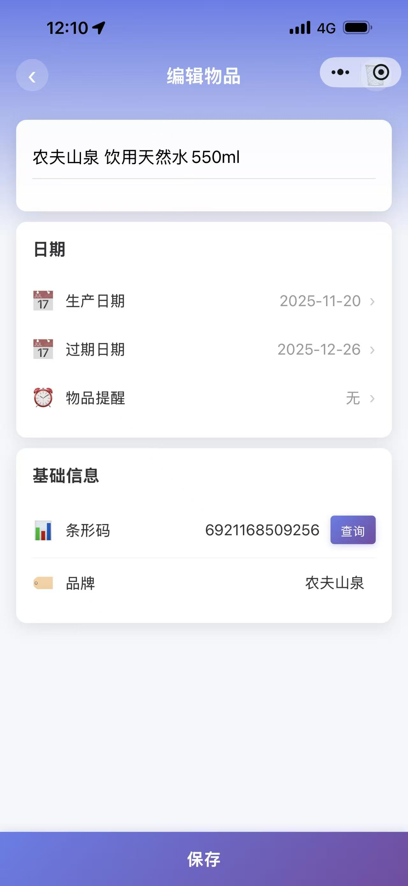
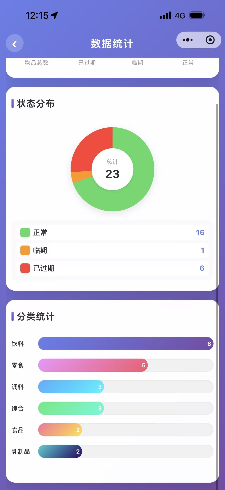
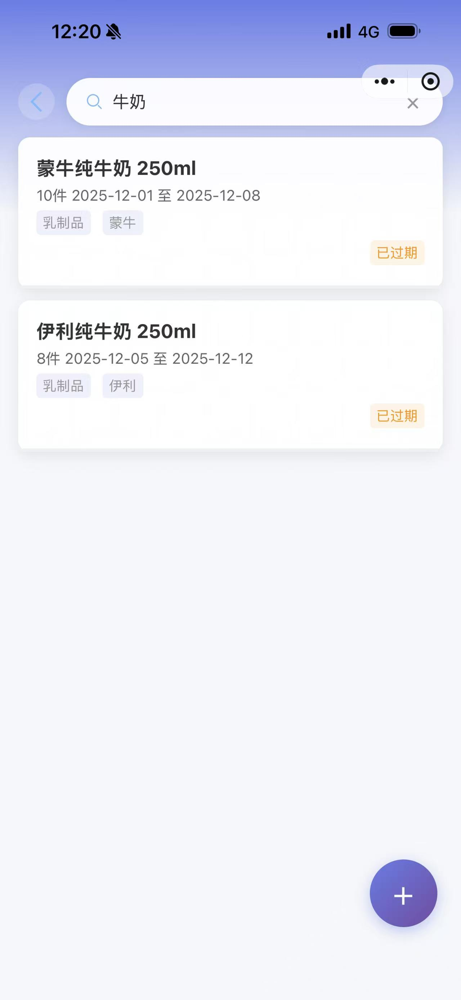
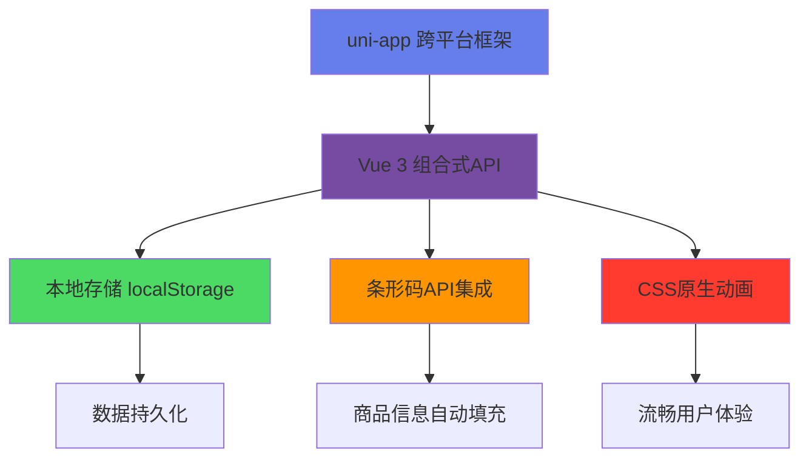

# 📦 RecordThings - 智能库存管理小程序

<div align="center">

 <!-- 📸 需要添加项目Logo -->

**再也不用担心东西过期了！**

[](https://opensource.org/licenses/MIT)
[](https://uniapp.dcloud.io/)
[](https://vuejs.org/)

[📱 在线体验](https://ckxkx.github.io/Recordthings) <!-- 📸 需要添加在线演示链接 --> | [🚀 快速开始](#-快速开始) | [✨ 功能演示](#-功能演示)

</div>

## 🎯 为什么选择 RecordThings？

> **3秒钟添加物品，7天提前提醒，再也不浪费！**

- 🥛 **牛奶过期了才发现？** → 7天提前提醒，绝不浪费
- 📦 **家里囤货一团糟？** → 智能分类，一目了然  
- 🏪 **小店库存管理累？** → 扫码录入，轻松搞定
- 📊 **不知道买什么？** → 数据分析，科学决策

 <!-- 📸 需要添加应用预览GIF -->

## ⚡ 30秒快速体验

```bash
# 1️⃣ 克隆项目（10秒）
git clone https://github.com/Ckxkx/Recordthings.git

# 2️⃣ 用HBuilderX打开项目文件夹（10秒）

# 3️⃣ 运行到微信开发者工具（10秒）
# 点击 运行 → 运行到小程序模拟器 → 微信开发者工具
```

**就这么简单！** 项目会自动加载示例数据，立即可以体验所有功能。

## ✨ 功能演示

### 🎬 核心功能一览（60秒看懂全部功能）

<table>
<tr>
<td width="50%" align="center">

**📱 3秒添加物品**

 <!-- 📸 需要添加物品录入GIF -->

扫码自动识别 | 手动快速录入

</td>
<td width="50%" align="center">

**⏰ 智能到期提醒**

 <!-- 📸 需要添加到期提醒GIF -->

7天提前预警 | 三色状态标识

</td>
</tr>
<tr>
<td width="50%" align="center">

**📊 可视化数据统计**

 <!-- 📸 需要添加统计图表GIF -->

饼图分布 | 趋势分析

</td>
<td width="50%" align="center">

**🔍 秒速搜索定位**

 <!-- 📸 需要添加搜索功能GIF -->

实时搜索 | 智能筛选

</td>
</tr>
</table>

### 🎮 互动演示

> **点击下方按钮，在线体验各个功能模块**

[](https://ckxkx.github.io/Recordthings/overview) <!-- 📸 需要添加在线演示链接 -->
[](https://ckxkx.github.io/Recordthings/add-item) <!-- 📸 需要添加在线演示链接 -->
[](https://ckxkx.github.io/Recordthings/statistics) <!-- 📸 需要添加在线演示链接 -->
[](https://ckxkx.github.io/Recordthings/search) <!-- 📸 需要添加在线演示链接 -->

## 🚀 快速开始

### 方式一：HBuilderX（推荐新手）

1. **下载 HBuilderX**：[官网下载](https://www.dcloud.io/hbuilderx.html)
2. **克隆项目**：
   ```bash
   git clone https://github.com/Ckxkx/Recordthings.git
   ```
3. **打开项目**：用 HBuilderX 打开项目文件夹
4. **运行项目**：点击工具栏 `运行` → `运行到小程序模拟器` → `微信开发者工具`

### 方式二：命令行（推荐开发者）

```bash
# 克隆项目
git clone https://github.com/Ckxkx/Recordthings.git
cd Recordthings

# 安装依赖（可选）
npm install

# 使用 uni-app CLI 运行
npx @dcloudio/uvm
npm run dev:mp-weixin
```

### 🎯 首次使用指南

1. **📱 打开小程序**：项目运行后会自动打开微信开发者工具
2. **�速 查看示例数据**：系统已预置示例数据，可直接体验
3. **➕ 添加第一个物品**：点击右下角"+"按钮
4. **📊 查看统计数据**：切换到"更多"页面，点击"数据统计"

## 🎨 界面预览

<div align="center">

### 📱 主要页面展示

 <!-- 📸 需要添加界面预览图 -->

*现代化渐变设计 | 毛玻璃效果 | 流畅动画交互*

</div>

## 🛠️ 技术架构

<div align="center">



</div>

### 🏗️ 核心技术栈

| 技术 | 版本 | 用途 |
|------|------|------|
| **uni-app** | 3.0+ | 跨平台开发框架 |
| **Vue** | 3.0+ | 前端框架 |
| **JavaScript** | ES6+ | 核心逻辑 |
| **CSS3** | - | 样式和动画 |
| **localStorage** | - | 数据存储 |

### 🎯 技术亮点

- ✅ **零依赖图表**：纯CSS实现饼图，无需第三方库
- ✅ **智能算法**：自动计算保质期和临期状态
- ✅ **响应式设计**：完美适配各种屏幕尺寸
- ✅ **本地优先**：数据存储在本地，响应速度快
- ✅ **模块化架构**：代码结构清晰，易于维护

## 📁 项目结构

```
RecordThings/
├── 📁 pages/              # 页面文件
│   ├── 📄 overview/       # 总览页面
│   ├── 📄 inventory/      # 库存页面  
│   ├── 📄 add-item/       # 添加物品
│   ├── 📄 statistics/     # 数据统计
│   └── 📄 search/         # 搜索功能
├── 📁 utils/              # 工具函数
│   ├── 📄 dbConfig.js     # 数据库配置
│   ├── 📄 barcodeApi.js   # 条形码API
│   └── 📄 auth.js         # 用户认证
├── 📁 static/             # 静态资源
├── 📄 App.vue             # 应用入口
├── 📄 main.js             # 主文件
└── 📄 pages.json          # 页面配置
```

## 🎯 使用场景

### 👨‍👩‍👧‍👦 家庭用户
- **冰箱管理**：牛奶、酸奶、剩菜等食品管理
- **药品管理**：家庭常备药品的有效期管理
- **日用品管理**：洗发水、牙膏等日用品库存

### � 小型商户
- **便利店**：商品库存和临期商品管理
- **餐厅**：食材采购和库存管理
- **药店**：药品有效期和库存管理

### 🏢 办公场所
- **茶水间**：咖啡、茶叶、零食管理
- **办公用品**：文具、耗材库存管理
- **清洁用品**：洗手液、纸巾等用品管理

## 📊 功能清单

### ✅ 已完成功能

- [x] 📱 物品录入（手动/扫码）
- [x] ⏰ 智能到期提醒
- [x] 📊 数据可视化统计
- [x] 🔍 全文搜索功能
- [x] 🏷️ 标签分类管理
- [x] 🏪 供应商管理
- [x] 📤 数据导入导出
- [x] 🎨 现代化UI设计

### 🚧 开发中功能

- [ ] ☁️ 云端数据同步
- [ ] 📱 推送通知
- [ ] 🤖 AI智能识别
- [ ] 🎤 语音录入

### 💡 计划中功能

- [ ] 👥 多人协作
- [ ] 📈 高级数据分析
- [ ] 🔗 供应链管理
- [ ] 🌐 开放API

## 🤝 参与贡献

我们欢迎所有形式的贡献！无论你是：

- 🐛 **发现了Bug** → [提交Issue](https://github.com/Ckxkx/Recordthings/issues)
- 💡 **有新想法** → [功能建议](https://github.com/Ckxkx/Recordthings/discussions)
- 👨‍💻 **想写代码** → [提交PR](https://github.com/Ckxkx/Recordthings/pulls)
- 📖 **完善文档** → [编辑Wiki](https://github.com/Ckxkx/Recordthings/wiki)

### 🔧 开发指南

1. **Fork 项目**
2. **创建功能分支**：`git checkout -b feature/AmazingFeature`
3. **提交更改**：`git commit -m 'Add some AmazingFeature'`
4. **推送分支**：`git push origin feature/AmazingFeature`
5. **创建 Pull Request**

## 📄 开源协议

本项目基于 [MIT License](LICENSE) 开源协议。

## �  致谢

感谢以下开源项目和服务：

- [uni-app](https://uniapp.dcloud.io/) - 跨平台开发框架
- [Vue.js](https://vuejs.org/) - 渐进式JavaScript框架
- [HBuilderX](https://www.dcloud.io/hbuilderx.html) - 开发工具

## 📞 联系我们

- 📧 **邮箱**：huichen_zhu@qq.com
- 💬 **微信群**：扫码加入交流群 <!-- 📸 需要添加微信群二维码 -->
- 🐛 **Bug反馈**：[GitHub Issues](https://github.com/Ckxkx/Recordthings/issues)
- 💡 **功能建议**：[GitHub Discussions](https://github.com/Ckxkx/Recordthings/discussions)

---

<div align="center">

**⭐ 如果这个项目对你有帮助，请给我们一个Star！⭐**

[](https://star-history.com/#Ckxkx/Recordthings&Date)

*让库存管理变得简单而优雅*

Made with ❤️ by RecordThings Team

</div>
